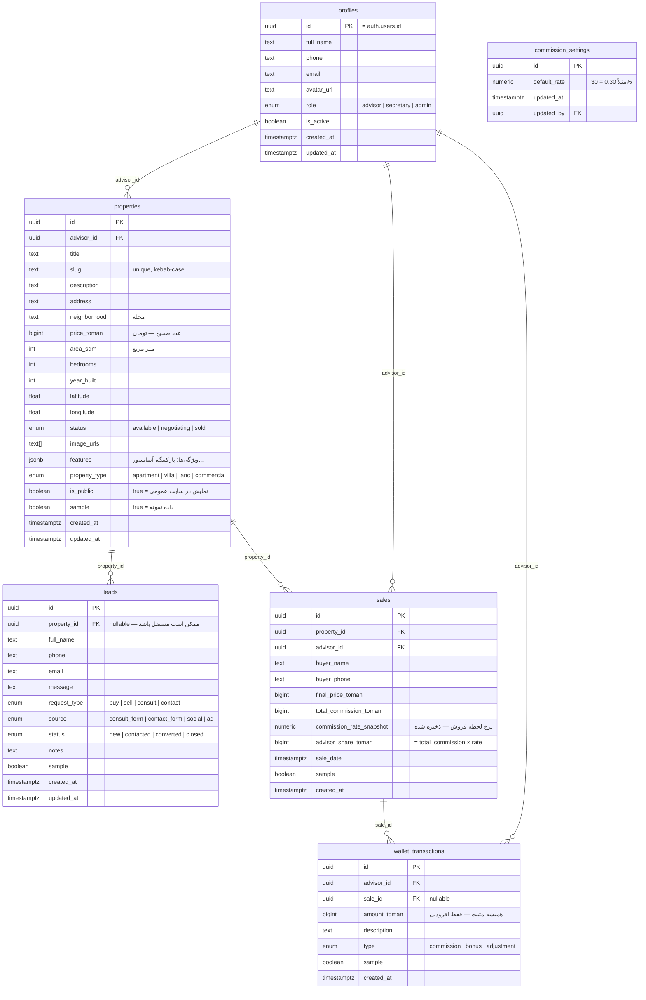

# Data Model

> همه مبالغ به **تومان** و به‌صورت **عدد صحیح** (بدون float) ذخیره می‌شوند.
> تاریخ‌ها با `timestamptz` (UTC) ذخیره و در UI به شمسی نمایش داده می‌شوند.

## Entity Relationship Diagram



## Public vs Private Fields

فیلدهای زیر در خروجی استاتیک سایت عمومی نمایش داده می‌شوند:

### properties (عمومی — فقط اگر `is_public = true`)
- `title`, `slug`, `description`, `address`, `neighborhood`
- `price_toman`, `area_sqm`, `bedrooms`, `year_built`
- `latitude`, `longitude`, `status`, `image_urls`
- `features`, `property_type`

### properties (خصوصی — فقط داشبورد)
- `advisor_id`, `is_public`, `sample`, `created_at`, `updated_at`

### leads, sales, wallet_transactions
- **هیچ فیلدی** در سایت عمومی نمایش داده نمی‌شود. فقط در داشبورد.

### profiles (عمومی — صفحه درباره ما)
- `full_name`, `avatar_url` (فقط مشاوران فعال)

### profiles (خصوصی)
- `phone`, `email`, `role`, `is_active`

## Indexes (Recommended)

```sql
-- Properties
CREATE INDEX idx_properties_status ON properties(status) WHERE is_public = true;
CREATE INDEX idx_properties_advisor ON properties(advisor_id);
CREATE UNIQUE INDEX idx_properties_slug ON properties(slug);

-- Leads
CREATE INDEX idx_leads_property ON leads(property_id);
CREATE INDEX idx_leads_status ON leads(status);

-- Sales
CREATE INDEX idx_sales_advisor ON sales(advisor_id);
CREATE INDEX idx_sales_property ON sales(property_id);

-- Wallet
CREATE INDEX idx_wallet_advisor ON wallet_transactions(advisor_id);
```

---

*تاریخ ایجاد: 2026-10-08*
